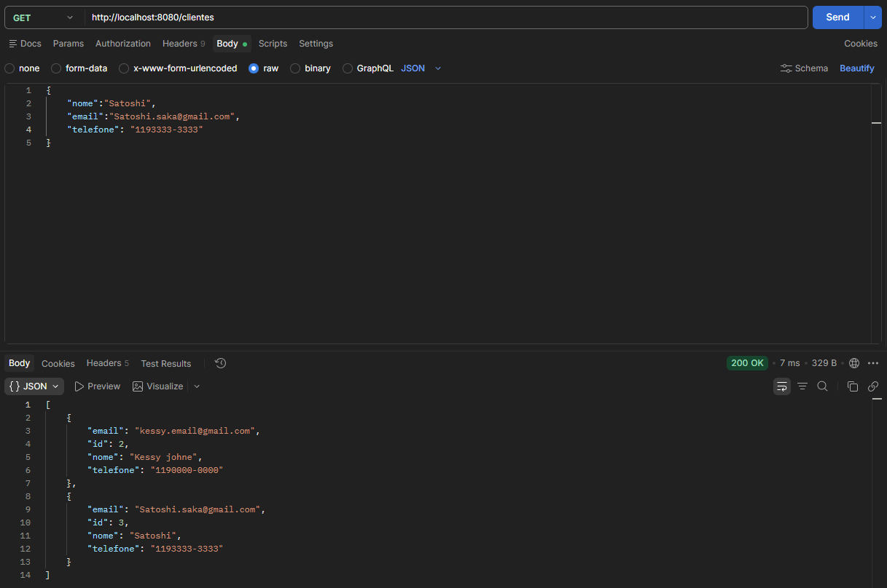

# API de Cadastro de Clientes

API REST desenvolvida em Java com Spring Boot para gerenciamento de clientes (CRUD completo).

## 🎯 Objetivo do projeto

Projeto criado para praticar o desenvolvimento de uma API REST com Spring Boot e JPA, como parte da minha transição de carreira para a área de desenvolvimento Java, aplicando conceitos de arquitetura em camadas (model, repository, controller) e persistência com banco de dados relacional.

## 🛠 Tecnologias

- Java 17
- Spring Boot
- Spring Data JPA
- MySQL
- Maven

## ▶️ Como executar

1. Clone o repositório
```bash
   git clone https://github.com/kessyjohne/api-cadastro-clientes-springboot.git
```
2. Configure suas credenciais do MySQL no arquivo `src/main/resources/application.properties`
3. Execute o projeto
```bash
   mvn spring-boot:run
```
4. A API estará disponível em `http://localhost:8080`

## 📌 Endpoints

| Método | Rota | Descrição |
|--------|------|-----------|
| POST | /clientes | Cria um novo cliente |
| GET | /clientes | Lista todos os clientes |
| GET | /clientes/{id} | Busca cliente por id |
| PUT | /clientes/{id} | Atualiza um cliente existente |
| DELETE | /clientes/{id} | Remove um cliente |

## 📸 Exemplo de uso

**Listando clientes (GET /clientes):**




## 🚀 Próximos passos

- [ ] Adicionar validação de campos (Bean Validation)
- [ ] Implementar autenticação e autorização com Spring Security + JWT
- [ ] Escrever testes automatizados (unitários e de integração)
- [ ] Containerizar a aplicação com Docker

## 👤 Autor

Kessy Johne  
[LinkedIn](https://www.linkedin.com/in/kessyjohne/) | [GitHub](https://github.com/kessyjohne)
